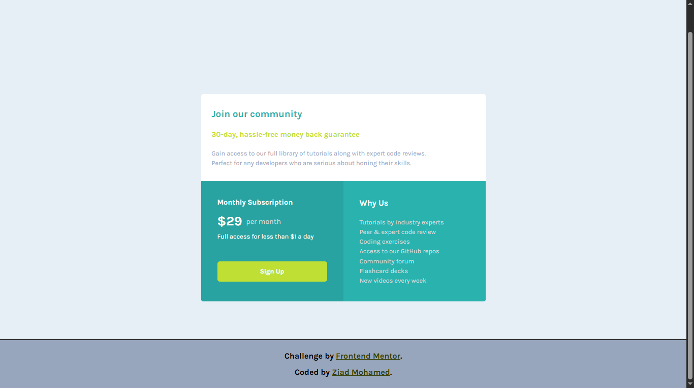

# 💳 Single Price Grid Component

  

A responsive pricing component built with HTML and CSS as part of a Frontend Mentor challenge.

## 📖 About the Challenge

This project is a solution to a Frontend Mentor challenge focused on building a responsive pricing layout using modern CSS techniques.

## ✨ Highlights

- 📱 Responsive layout for mobile and desktop.
- 🧩 CSS Grid for the overall page layout.
- 📦 Flexbox for content alignment.
- 🎨 Clean typography and spacing.
- 🧱 Semantic HTML structure.

## 🛠️ Built With

  

## 💡 Key Takeaways

Throughout this project, I:

- Reinforced my understanding of CSS Grid by building a multi-section responsive layout.
- Combined CSS Grid and Flexbox to create clean and organized components.
- Practiced writing responsive layouts while keeping the code simple and maintainable.
- Improved my confidence in choosing the right layout technique for different parts of a page.

## 🔗 Links

- 🌐 **Live Site:** https://frontend-mentor-single-price-grid-c-theta.vercel.app/
- 💻 **Repository:** https://github.com/Ziad-mo205/Frontend-Mentor---Single-price-grid-component.git
- 🎯 **Frontend Mentor Solution:** https://www.frontendmentor.io/solutions/responsive-single-price-grid-component-using-css-grid-d6jcR7OzZE